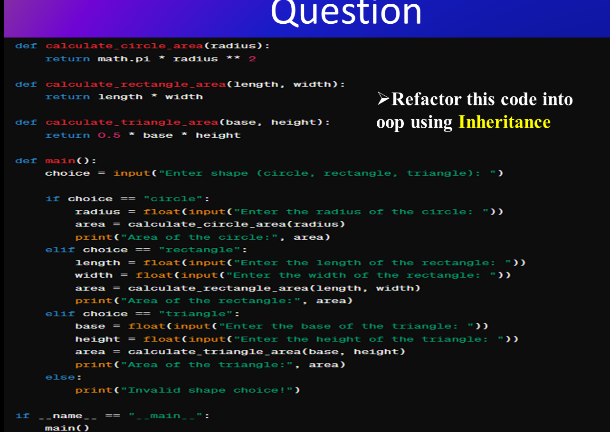
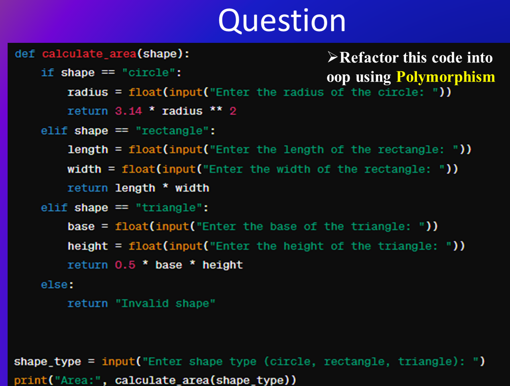

# 1st Qusetions 


## Answer

```sh
import math
class Shape:
       
    def area_of_circle(self,radius):
        return math.pi*radius**2
    
    def area_of_rectangle(self,length, width):
        return length*width
    
    def area_of_triangle(self,base,height):
        return .5*base*height

class Area(Shape):
    def __init__(self,choice) :
        self.choice=choice
    def area(self):
        if self.choice=='circle':
            radius=float(input('Enter the redius of the circle: '))
            print('Areal of the circle:',super().area_of_circle(radius))
        elif self.choice=='rectangle':
            length,width=float(input('length of rectangle: ')),float(input('width of rectangle: '))
            print('Area of rectangle:',super().area_of_rectangle(length,width))
        elif self.choice=='triangle':
            base,height=float(input('base of triangle: ')),float(input('height of triangle: '))
            print('Area of triangle:',super().area_of_triangle(base,height))
        else :
            print('Invalid shape choice!')


choice=input("Enter shape (circle, rectangle, triangle): ")
all_shape=Area(choice)
all_shape.area()
```

# 2nd Questions


## Answer
```sh
import math
class Shape:
    
    def __init__(self) -> None:
        pass

    def area(self)->None:
        pass
class Circle(Shape):
    def __init__(self, radius):
        self.radius=radius
        
    def area(self):
        return math.pi*self.radius**2
class Rectangle(Shape):
    def __init__(self, length,width):
        self.length=length
        self.width=width
    def area(self):
        return self.length*self.width
class Triangle(Shape):
    def __init__(self,base,height):
        self.base=base
        self.height=height

    def area(self):
        return .5*self.base*self.height


def main(choice):
        if choice=='circle':
            radius=float(input('Enter the redius of the circle: '))
            circle=Circle(radius)
            print('Areal of the circle:',circle.area())
        elif choice=='rectangle':
            length,width=float(input('length of rectangle: ')),float(input('width of rectangle: '))
            rectangle=Rectangle(length,width)
            print('Area of rectangle:',rectangle.area())
        elif choice=='triangle':
            base,height=float(input('base of triangle: ')),float(input('height of triangle: '))
            triangle=Triangle(base,height)
            print('Area of triangle:',triangle.area())
        else :
            print('Invalid shape choice!')


choice=input("Enter shape (circle, rectangle, triangle): ")
main(choice)
```
